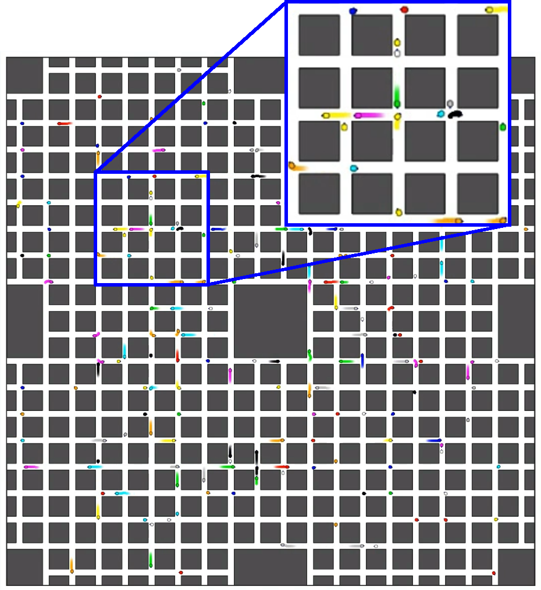
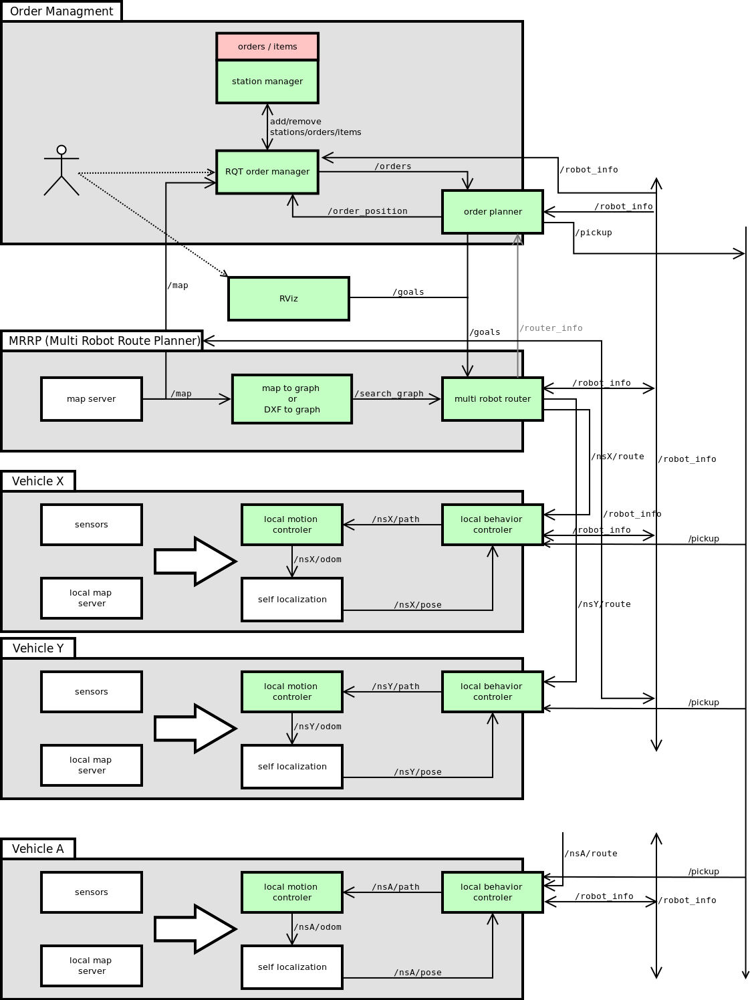
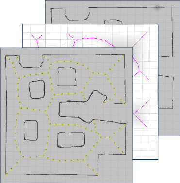
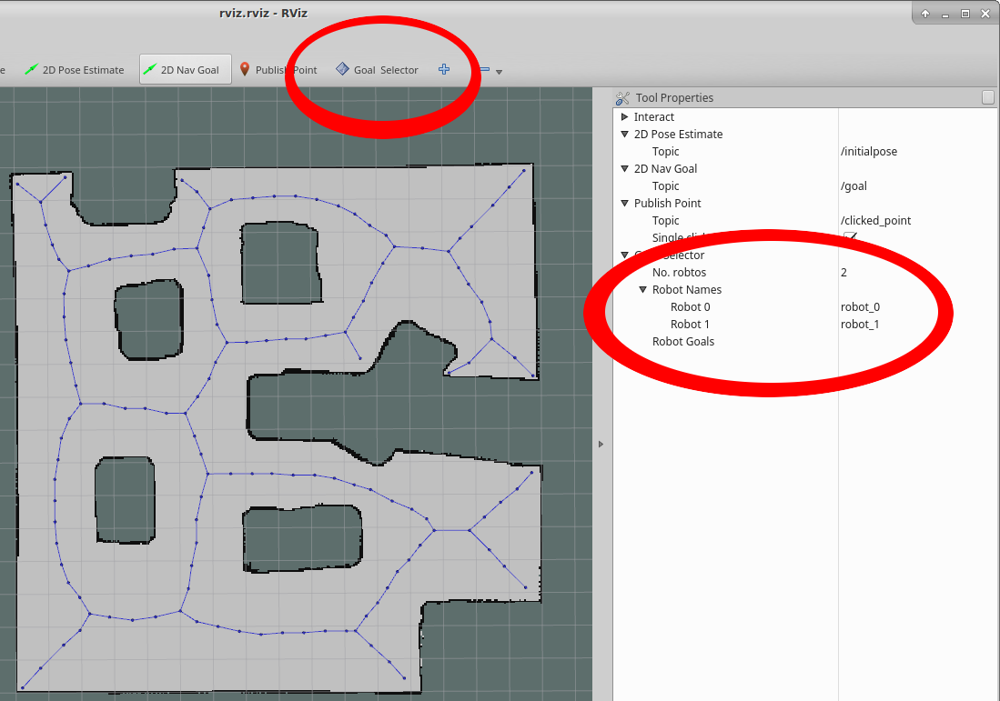
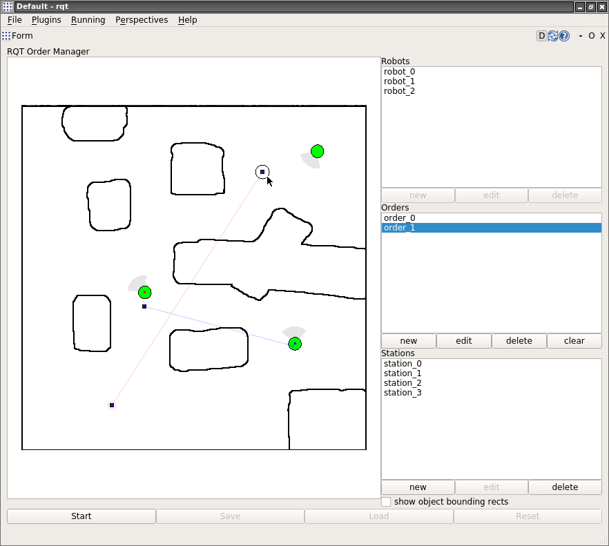

tuw\_multi\_robot
===



This repository includes ros packages to plan routes for multiple robots on a search graph. It creates a search graph out of a pixel map and tries to find a path for multiple robots using an extended approach for prioritized planning. The inputs are the tuw_multi_robot_msgs/RobotInfo messages which include the robots pose, the map and the desired goal poses. The output are multiple synchronized routes given to the individual robots. 

# Installation
Have a look at the [INSTALL.md](INSTALL.md) file

# Demos / Tutorials
Have a look at the [tuw_multi_robot_demo/README.md](tuw_multi_robot_demo/README.md) file

# Packages
* tuw\_multi\_robot\_ctrl
* tuw\_multi\_robot\_demo
* tuw\_multi\_robot\_goal\_generator
* tuw\_multi\_robot\_local\_behavior\_controller
* tuw\_multi\_robot\_router
* tuw\_multi\_robot\_rviz
* tuw\_order\_planner
* tuw\_rqt\_ordermanager
* tuw\_voronoi\_graph

# System overview


This figure represents the current state and planned developments on the tuw\_multi\_robot framework. The framework is designed to cover all tools needed for an automated delivery system with autonomous vehicles. The current state of the system allows one to set goals for multiple vehicles using RViz, a configuration file, or an order mangement system which is capable to assign vehicles for specific deliveries and generates goals for the multi robot route planner. The green boxes show already existing modules while the red boxes are not yet implmented/released. The system provides a simple local motion controller for all robots, which allows a high number (> 100) of vehicles to be controlled in real time using stage. Furthermore, the design allows the usage of existing individual controllers such as DWA implmented in move_base.

## tuw\_multi\_robot\_demo
Contains launch and config files to run a sample demo. 

```
roslaunch tuw_multi_robot_demo demo.launch room:=cave  nr_of_robots:=3 
roslaunch tuw_multi_robot_demo demo.launch room:=warehouse032  nr_of_robots:=14 
roslaunch tuw_multi_robot_demo demo.launch room:=warehouse200  nr_of_robots:=50 
```
## tuw\_multi\_robot\_goal\_generator
Using this pkg one can generate, save and read goal lists.
The random goal generation needs a running map publisher in order to generate valid goals.

```
# for cave with 3 robots
rosrun tuw_multi_robot_goal_generator goals_random _nr_of_robots:=3 _distance_boundary:=0.6 _distance_to_map_border:=0.2 _nr_of_avaliable_robots:=3
# for warehouse032 with 14 robots
rosrun tuw_multi_robot_goal_generator goals_random _nr_of_robots:=32 _distance_boundary:=0.6 _distance_to_map_border:=0.2 _nr_of_avaliable_robots:=14
# for warehouse200 with 50 robots
rosrun tuw_multi_robot_goal_generator goals_random _nr_of_robots:=200 _distance_boundary:=0.6 _distance_to_map_border:=0.2 _nr_of_avaliable_robots:=50
```
## tuw\_voronoi\_graph
This package includes a voronoi-graph-generator, a dxf-to-graph-node and a segment-to-graph node for creating search graphs for the multi robot router.

The _voronoi-graph-generator-node_ receives a pixel map ([occupancy\_grid](http://docs.ros.org/api/nav_msgs/html/msg/OccupancyGrid.html)) and converts it into a voronoi graph describing the original map. This graph is automatically generated or loaded from a cache folder if saved. Additionally the node can load specific graphs saved in a folder.



The _voronoi-dxf-to-graph_ takes a dxf file as input containing the scaled and transformed map and any number of lines arcs and circles. These lines arcs and circles are converted to a graph and saved to a specific location.


The _voronoi-segment-to-graph-node_ takes a segment file with predefined segments as input and converts it to a graph, which is published afterwards.

The _graph-generator-node_ receives a grid\_map like the one published from voronoi-map-generator-node and converts it into a graph message for use in tuw\_multi\_robot\_route\_planner.

## tuw\_multi\_robot\_router
The tuw_multi_robot_router is a Multi Robot Route Planner, which subscribes to tuw_multi_robot_msgs/RobotInfo messages, to the map/graph published from the tuw_voronoi_graph package, and to the tuw_multi_robot_msgs/RobotGoalsArray message.

The MRRP uses a prioritized planning approach to find the robots routes. Additionally, there are a Priority and a Speed Rescheduler as well as a Collision resolver integrated to solve special scenarios not solvable by standard prioritized planning approaches. Since the results generated for these scenarios are interdependent, the given routes have to be executed in a synchronized fashion. Therefore, the Router publishes a tuw_multi_robot_msgs/Route containing preconditions, when a robot is allowed to enter a segment. Additionally a unsynchronized version via nav_msgs/Path is published for every robot. The algorithm is documented in the master thesis [2] and published at IROS [1]. 

## tuw\_multi\_robot\_rviz
Presents rviz plugins to set goal positions for the planner and a tool to visualize generated graphs. 



## tuw\_multi\_robot\_ctrl
A simple multi robot controller using tuw_multi_robot_msgs/Route messages as input, which are used to execute the path in a synchronized fashion. (The global controller is used for testing with a high number of robots)

## tuw\_multi\_robot\_local\_behavior\_controller
This package contains a node, which receives the tuw_multi_robot_msgs/RouteSegment message for a robot and publishes a nav_msgs/Path up to the point a robot is allowed to move.

A tuw_multi_robot_msgs/RouteSegment contains a set of segments, where each of them has preconditions to tell when a robot is allowed to enter a certain segment. The tuw_multi_robot_route_to_path_node subscribes to these messages and checks how many of these preconditions are met and publishes a path from start to the last segment, for which the preconditions are met. This node subscribes to all robots as one node for performance reasons while testing with a large number of robots. 

## tuw\_order\_planner
Assigns robots to orders and publishes goals until all orders are complete. See [tuw\_order\_planner](tuw\_order\_planner).

## tuw\_rqt\_ordermanager
RQT plugin to build stations interactively and assign them to orders. See [tuw\_rqt\_ordermanager](tuw\_rqt\_ordermanager).


# References
http://wiki.ros.org/tuw_multi_robot

# Citations
* [1] [B. Binder, F. Beck, F. König and M. Bader, "Multi Robot Route Planning (MRRP): Extended Spatial-Temporal Prioritized Planning," 2019 IEEE/RSJ International Conference on Intelligent Robots and Systems (IROS), Macau, China, 2019, pp. 4133-4139, doi: 10.1109/IROS40897.2019.8968465](https://ieeexplore.ieee.org/document/8968465)
* [2] [B. Binder. (2017), "Spatio-Temporal Prioritized Planning (Master thesis)", Retrieved from TU Wien Bibliothekssystem (Accession No. AC14520240)](http://repositum.tuwien.ac.at/obvutwhs/content/titleinfo/2400890)
