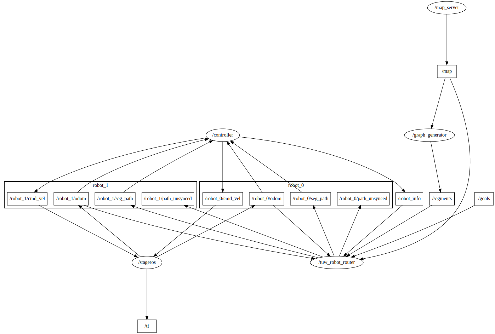
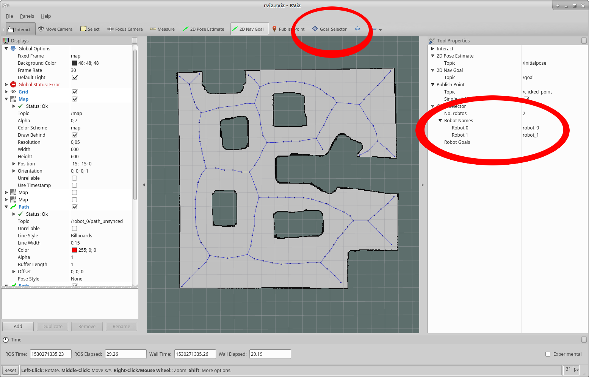

# Two robots with stage 

This demo starts 
- a map server providing a occupancy grid map
- a graph generator to generate a voronoi graph for routing
- a stage simulation with tree robots
- a rviz configuration to set goals
- a __single__ vehicle controller (for performace issues) to control all robots with a simple PID controller
	- to send motion commands (twist) to the simulated robots
	- to publish robot info messages for all robots

```
roslaunch tuw_multi_robot_demo demo.launch room:=cave cfg:=robot_2
```

In order to start the planner follow the following steps
1. check first if the number of robots are set to __2__. (see figure)
2. click the __Goal Selector__ and select the goal for the first robot.
3. click the __Goal Selector__ again select the goal for the second robot.
The vehicles should start driving






